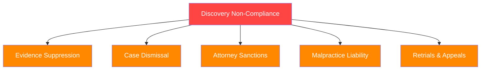
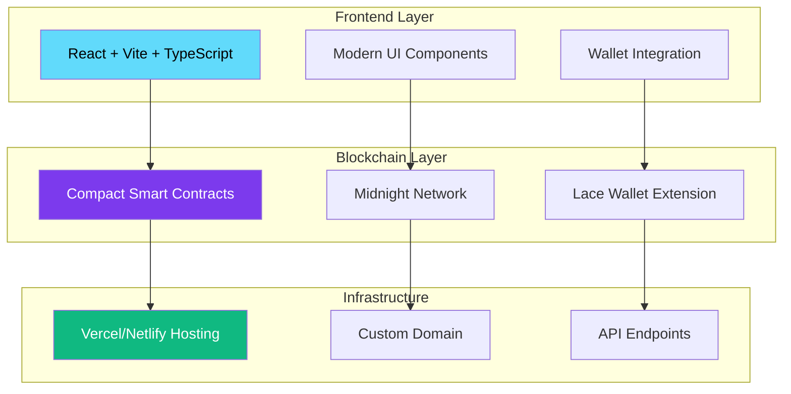
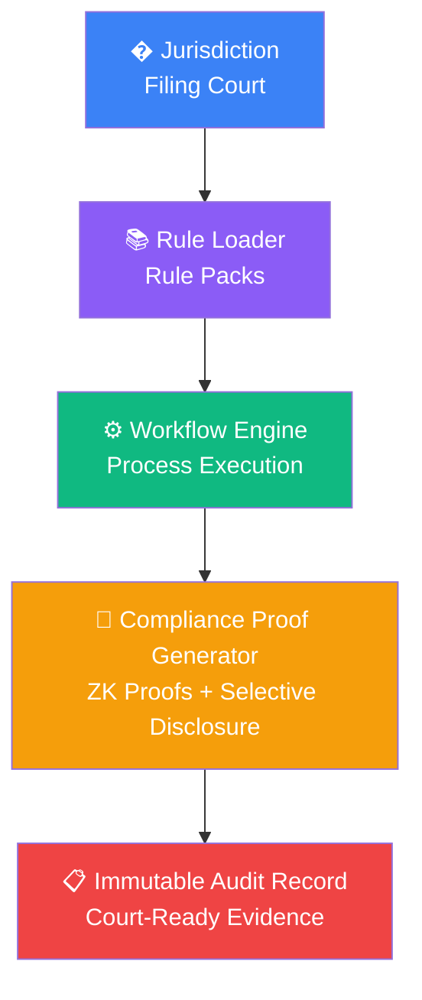
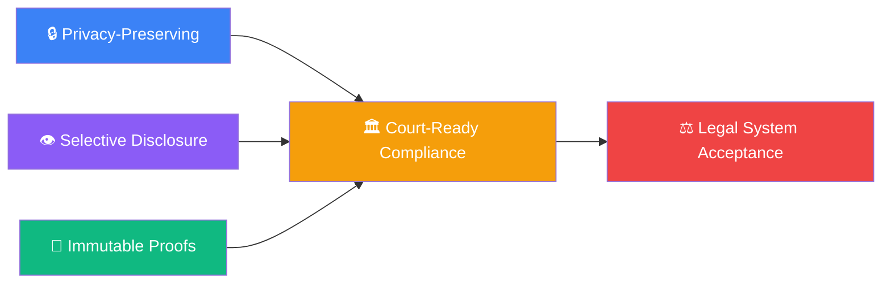

# 🏛️ AutoDiscovery - Visual Project Overview

> **Automated discovery compliance: build once, comply everywhere.**

---

## 📋 Executive Summary

<div align="center">

### 🔐 **Midnight-Based dApp for Automated Legal Discovery**

AutoDiscovery revolutionizes legal discovery workflows with **jurisdiction-aware compliance**. The platform uses modular rule packs to apply correct regional legislation and procedural rules based on the court where the case is filed—eliminating discovery non-compliance risks that lead to sanctions, dismissed cases, or suppressed evidence.

</div>

---

## ⚖️ Problem Statement

### The Discovery Compliance Crisis

<div align="center">


</div>

Legal discovery—the pre-trial evidence exchange process—is governed by **different rules in every jurisdiction**:

| 🏛️ **Federal Courts** | 🏢 **State Courts** | ⚖️ **Specialized Courts** |
|----------------------|-------------------|-------------------------|
| Federal Rules of Civil Procedure (FRCP) | State-specific rules (IRCP, URCP, CR, etc.) | Bankruptcy, Family, Administrative |

### 🚨 **Consequences of Non-Compliance**

<div align="center">



</div>

### 💡 **Current Pain Points**

1. **🔍 Manual Jurisdiction Lookup** — Attorneys must manually identify applicable rules
2. **📚 Rule Version Drift** — Procedural rules change; staying current is burdensome  
3. **🌐 Multi-Jurisdiction Cases** — Cases spanning states multiply complexity
4. **👨‍⚖️ Expert Witness Compliance** — W-9/I-9 collection, Standard of Care documentation
5. **📋 No Audit Trail** — Difficult to prove compliance was followed

---

## 🚀 Solution: AutoDiscovery

### Core Architecture

<div align="center">


</div>

### 🔧 **Key Features**

| Feature | Description | Technology |
|---------|-------------|------------|
| **🤖 Automated Workflow Engine** | Step-by-step discovery process execution | Compact Smart Contracts |
| **📦 Jurisdiction Rule Packs** | Modular per-state rules loaded at case creation | TypeScript/React |
| **🔐 Immutable Compliance Proofs** | Midnight ZK proofs as factual record | Zero-Knowledge Proofs |
| **👁️ Selective Disclosure** | Reveal only what's required, prove the rest | Privacy-Preserving Tech |

### 💬 **Key Taglines**

> *"Automated legal discovery — jurisdiction-aware by design."*  
> *"Remove the risks of failing to disclose or handle discovery properly — regional compliance is baked in."*  
> *"Prove compliance in an immutable fashion that can be entered as factual record."*  
> *"AutoDiscovery doesn't just help you manage discovery — it mathematically proves you did it right."*

---

## 🏗️ Technical Architecture

### Tech Stack

<div align="center">



</div>

### 📁 **Project Structure**

```
🚀 AutoDiscovery/
├── 🔧 autodiscovery-contract/     # Compact smart contracts
│   └── 📂 src/
│       ├── 📄 discovery.compact   # Main discovery workflow contract
│       ├── 🗺️ jurisdiction.compact # Jurisdiction rule loader
│       └── ✅ compliance.compact  # Compliance proof generation
├── 💻 autodiscovery-cli/          # CLI tools for deployment/testing
├── 🎨 frontend-vite-react/        # React frontend
│   └── 📂 src/
│       ├── 🧩 components/         # UI components
│       ├── 🪝 hooks/              # Midnight wallet hooks
│       └── 📄 pages/              # App pages
├── 📚 docs/                       # Documentation
└── ⚖️ rule-packs/                 # Jurisdiction rule modules
    ├── 🇺🇸 federal/
    ├── 🥔 idaho/
    ├── 🏔️ utah/
    └── 🌲 washington/
```

### 🔄 **Smart Contract Architecture**

<div align="center">



</div>

---

## 🗺️ Phase 1: Target Jurisdictions

<div align="center">


</div>

| 🏛️ **Jurisdiction** | ⚖️ **Rules** | 🎯 **Priority** | 📝 **Notes** |
|-------------------|-------------|---------------|-------------|
| **🥔 Idaho** | IRCP (Idaho Rules of Civil Procedure) | 🔴 High | Spy's primary jurisdiction |
| **🏔️ Utah** | URCP (Utah Rules of Civil Procedure) | 🔴 High | Adjacent state comparison |
| **🌲 Washington** | CR (Civil Rules) | 🔴 High | Pacific Northwest coverage |
| **🗽 New York** | CPLR (Civil Practice Law and Rules) | 🔴 High | Major market, complex rules |
| **🌴 California** | CCP (Code of Civil Procedure) | 🔴 High | Largest state market |

### 🎨 **Workflow Mapping Strategy**

1. **📊 Create Miro flowchart** for each jurisdiction's discovery process
2. **🎨 Color-code** differences (A/B/C for ID/UT/WA)
3. **🔀 Identify decision forks** where jurisdiction rules diverge
4. **🔗 Map to smart contract** functions at each node

---

## 🏥 Use Cases

### 🩺 **Primary: Medical Malpractice Discovery**

<div align="center">


</div>

Medical malpractice cases require:
- **👨‍⚕️ Standard of Care (SOC)** expert identification
- **📄 Expert witness W-9/I-9** collection  
- **🏥 Medical records** request compliance
- **🔒 HIPAA** privacy requirements

**AutoDiscovery handles jurisdiction-specific:**
- ⏰ Disclosure deadlines
- 👥 Expert witness designation rules
- 📋 Privilege log requirements
- 💻 E-discovery protocols

### ⚖️ **Secondary: General Civil Litigation**

- 📋 Contract disputes
- 🚗 Personal injury
- 👔 Employment cases
- 🏠 Real estate litigation

### 🔮 **Future: Specialized Courts**

- ⚖️ Federal bankruptcy discovery (uniform rules)
- 👨‍👩‍👧‍👦 Family court proceedings
- 🏛️ Administrative hearings

---

## 🏆 Competitive Advantage

### 🌙 **Why Midnight?**

<div align="center">



</div>

1. **🔒 Privacy-preserving** — Sensitive case data stays private
2. **👁️ Selective disclosure** — Reveal only what opposing counsel needs
3. **🔐 Immutable proofs** — Compliance attestations can't be altered
4. **🔍 Auditability** — Courts can verify without seeing underlying data

### ⚖️ **Why Courts = Legitimization**

Courts guard precedent fiercely. In one case, a judge refused to let a plaintiff shortcut SCRA military status verification by simply asking the defendant under oath—calling the suggestion "slippery" because it would set dangerous precedent.

**🔄 The inverse is equally powerful:** Once courts accept ZK proofs as factual record, that precedent binds all future proceedings. No industry can question what the legal system has validated.

---

## 🛣️ Roadmap

### 🎯 **Phase 1: MVP (Hackathon Target)**
- [ ] 🔧 Basic discovery workflow contract
- [ ] 🥔 Idaho jurisdiction rules (single state)
- [ ] 🎨 Simple frontend with wallet connection
- [ ] ✅ Proof-of-concept compliance attestation

### 🌐 **Phase 2: Multi-Jurisdiction**
- [ ] 🏔️ Utah, Washington, NYC, California rule packs
- [ ] 📊 Jurisdiction comparison view
- [ ] 🔀 Workflow forking based on filing court

### 🚀 **Phase 3: Production**
- [ ] 🇺🇸 Full federal rules integration
- [ ] 👨‍⚕️ Expert witness management module
- [ ] 💻 E-discovery document handling
- [ ] 🏛️ Court integration APIs

---

## 👥 Team

<div align="center">

| 👤 **Member** | 🎭 **Role** | 🔗 **GitHub** |
|-------------|-------------|---------------|
| **🕵️ Spy** | Domain Expert (Retired Paralegal) | [@SpyCrypto](https://github.com/SpyCrypto) |
| **💻 John** | Developer, Midnight Builder | [@bytewizard42i](https://github.com/bytewizard42i) |

</div>

---

## 🎯 Hackathon Target

<div align="center">


### 🎪 **Event:** Midnight Vegas Hackathon  
### 📅 **Date:** April 2026  
### 🏆 **Goal:** Working MVP demonstrating automated jurisdiction-aware discovery compliance

</div>

---

## 🔬 Research Needed

### ⚖️ **Discovery Non-Compliance Case Studies**

Find examples where attorneys had cases thrown out or evidence suppressed due to discovery non-compliance. These become **counter-examples** that AutoDiscovery solves:

- [ ] ❌ Failure to disclose expert witnesses on time
- [ ] 📋 Improper privilege log formatting
- [ ] 📄 Missing mandatory disclosures
- [ ] 💾 E-discovery spoliation
- [ ] 🗺️ Jurisdiction rule misapplication

### 📚 **Jurisdiction Rule Documentation**

- [ ] 🥔 Idaho IRCP full text + commentary
- [ ] 🏔️ Utah URCP full text + commentary  
- [ ] 🌲 Washington CR full text + commentary
- [ ] 🇺🇸 Federal FRCP for comparison

---

## 🚀 Getting Started (Development)

<div align="center">

```bash
# 📥 Clone the repo
git clone git@github.com:bytewizard42i/AutoDiscovery.git
cd AutoDiscovery

# 📦 Install dependencies
npm install

# 🔨 Build contracts
npm run build

# 🌐 Start frontend dev server
npm run dev:frontend
```

</div>

### 📋 **Prerequisites**

- ✅ Node.js v23+
- ✅ Docker
- ✅ Git LFS
- ✅ Compact tools (`compact check`)
- ✅ Lace wallet extension

---

## 🤝 Potential Collaborators

<div align="center">

| 🏢 **Partner** | 🎭 **Role** | 📝 **Notes** |
|--------------|-------------|-------------|
| **🔮 Charli3 Oracles** | Oracle Infrastructure | Potential data feed partner for [GeoZ](https://github.com/bytewizard42i/GeoZ_us_app_Midnight-Oracle) companion project |
| **🛡️ OpenZeppelin** | Smart Contract Security | Compact contract templates and security patterns |
| **🎨 NMKR** | NFT/Token Infrastructure | Potential integration for compliance credential tokens |

</div>

---

## 📚 Resources

<div align="center">

| 🔗 **Resource** | 📝 **Description** |
|----------------|-------------------|
| [📖 Midnight Docs](https://docs.midnight.network/) | Official documentation |
| [🎨 MeshJS Midnight Starter](https://github.com/MeshJS/midnight-starter-template) | Template base |
| [🚀 Midnight Awesome dApps](https://github.com/midnightntwrk/awesome-midnight-dapps) | Community projects |
| [🛡️ OpenZeppelin Compact Contracts](https://github.com/OpenZeppelin/compact-contracts) | Security patterns |
| [🔮 Charli3 Oracles](https://charli3.io/) | Oracle infrastructure |

</div>

---

<div align="center">

# 🌙 **Built with Midnight Network — Privacy meets compliance.**

<div align="center">


</div>

---

*© 2026 AutoDiscovery - Revolutionizing Legal Discovery with Privacy-Preserving Technology* 🚀

</div>
