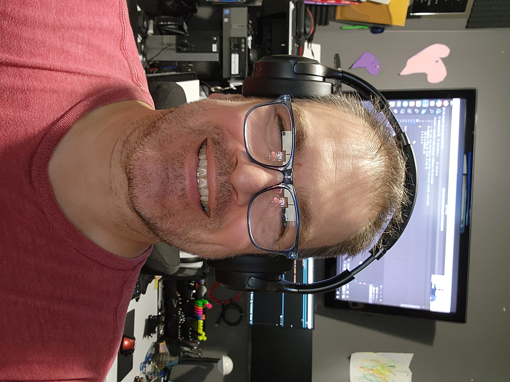

# John Santi

**`johnny5i`** · Midnight NightForce Bravo · 4-Time Hackathon Winner

*Milestones · Last 6 Months*

---

## Credentials & Highlights

| | |
|---|---|
| **Midnight NightForce** | Recruit → Alpha → **Bravo** |
| **Midnight Aliit Fellow** | (inactive) |
| **Hackathon Wins** | 4-Time Winner — including Inaugural and London Midnight Summit (AI Track) |
| **i\_am\_midnight MCP** | One of the first Midnight MCPs — [GitHub](https://github.com/bytewizard42i/i_am_Midnight_LLM_ref_repo) |
| **SoulSketch** | World's first persistent memory protocol for AI models across platforms — [GitHub](https://github.com/bytewizard42i/soulSketch) |
| **Cardano** | Certified Blockchain Associate |
| **Emurgo** | Certified Business Blockchain Consultant |
| **Midnight Academy** | 3 Certifications |

---

## Role — AutoDiscovery.legal

`Developer` · `Midnight Builder` · `Theoretical Systems Architect` · `Video & Audio (Pre/Post)`

> **Core Focus** — Selective/Rational Privacy-first legal technology — automation + compliance on the Midnight Network, powered by zero-knowledge proofs.

---

## Strengths

### Full-Stack Development

TypeScript, React, Next.js, Vite, Express, Docker, CI/CD.
Builds both frontend and backend — two complete frontend apps (demoLand + realDeal) for AutoDiscovery alone.

### Smart Contract Architecture

Designs and implements smart contracts in **Compact** on the Midnight Network. Authored all **6 core AutoDiscovery contracts**: `discovery-core`, `jurisdiction-registry`, `compliance-proof`, `document-registry`, `access-control`, and `expert-witness`. All compiling. **20+ exported ZK circuits.**

### Zero-Knowledge Protocol Design

ZK-based compliance attestations — provable, privacy-preserving records that a legal discovery process followed jurisdictional rules, without exposing case content. Designed the attestation model, proof generation flow, and verification architecture.

### Product & Architecture

Architect of the **"build once, comply everywhere"** jurisdiction-aware discovery compliance engine. Created the **demoLand/realDeal provider pattern** — a 12-interface abstraction layer that lets the same UI run against mock data or live Midnight contracts. Rolled this pattern across 12 products in the DIDz ecosystem.

---

## Notable Contributions

### MidnightVitals

Real-time diagnostic console for Midnight DApps. Monitors wallet health, proof server status, contract state, and network connectivity with interaction logging. Iterated from **v0.1.0 → v0.3.8 in a single day.** Integrated into AutoDiscovery and designed as a standalone product with open-source, Pro, and Enterprise tiers.

### Midnight NightForce Team

Ambassador for the Midnight blockchain ecosystem. Active in community building, developer education, and ecosystem growth.

### Build Club Fellowship

Midnight Build Club — completed customer analysis, pitch deck, video script, and preparing for Demo Day presentation.

---

## DIDz Ecosystem — 20+ Products on Midnight

*Designed and maintains a portfolio of 20+ privacy-first products built on Midnight, all under the DIDzMonolith umbrella.*

| Product | Description |
|---------|-------------|
| **AutoDiscovery.legal** | Legal discovery compliance |
| **DIDz-io** | Decentralized identity engine |
| **KYCz** | Privacy-preserving KYC |
| **GeoZ** | Geolocation oracle |
| **SelectConnect** | Privacy-first contact sharing |
| **SilentLedger** | Confidential exchange transactions |
| **EncryptVault** | Encrypted document storage, legacy estate planning for crypto — reaggregated seed phrases, remote NAS backups, Shamir-type seed abstraction with bounties |
| **ProMingle** | Semi-decentralized professional networking |
| **SouLink** | Soul-bound persistent AI memory protocol |
| **PopCork** | Event coordination & access protocol |
| **HuddleBridge** | Semi-decentralized video communications protocol with anti-rug tech |
| **DownMan** | Privacy-preserving emergency notifications and roll call protocol |
| **SafeHealthData** | Privacy-preserving healthcare records with HIPAA-compliant scientific data sharing |
| **PetProData** | Companion animal health records and RWA tokenization for property and provenance |
| **EquineProData** | Equine identity, provenance, and health records |
| **SharedScience.me** | Scientific collaboration and privacy-preserving theory sharing — collaborate without sacrificing proprietary IP, yet allows synergies to join voluntarily |
| **MidnightVitals** | Real-time DApp diagnostic console for Compact smart contract protocols |

---

## Additional Contributions

### demoLand Auth Standard

Designed and deployed a standardized **8-method authentication** frontend across all 12 DIDz ecosystem products — email, PGP, YubiKey, DID wallet, Trezor, biometric, Chrome OAuth, and Brave OAuth.

### CI/CD & DevOps

Built GitHub Actions workflows for automated Compact contract compilation, artifact management, and reproducible local development with Docker.

---

## By the Numbers

*AutoDiscovery.legal alone*

| | |
|---|---|
| **155** commits | **6** Compact smart contracts (all compiling) |
| **20+** exported ZK circuits | **12** provider interfaces |
| **2** frontend apps (demoLand + realDeal) | **11** UI pages |
| **40+** documentation files | **22** media / brand assets |

---

## Tech Stack

| Layer | Technologies |
|-------|-------------|
| **Blockchain** | Midnight Network, Compact, ZK proofs, Lace wallet |
| **Frontend** | React, Next.js, Vite, TailwindCSS, HTML/CSS |
| **Backend** | TypeScript, Node.js, Express |
| **DevOps** | GitHub Actions, Docker, Turborepo, npm workspaces |
| **Tools** | Puppeteer, MCP servers, Git multi-remote workflows |

---

*John Santi · johnny5i · March 2026*

